# Data pack Phoenix
Data pack create for use on a private server with friends.  
Data pack créer pour une utilisation sur un serveur privé entre amis.

## Changes

### Minecraft
#### Recipes / recettes
[:open_file_folder:folder => data/minecraft/recipes](data/minecraft/recipes)  

| file | change |
|--|--|
|packed_ice.json | "group": "packed_ice"|
|*_stairs.json | result count to 6|

---
### Phoenix
The additions.   
Les ajouts.   
#### Advancements / avancements
##### Phoenix
[:open_file_folder:folder => data/phoenix/advancements/phoenix](data/phoenix/advancements/phoenix)
```
root
|__all_structures
|__courez
|__dangereuse_peche
|__findus
|  |_gostbuster
|__winter_is_comming
|  |_iron_golem
|__space_marine
```

##### Recipes / recettes
[:open_file_folder:folder => data/phoenix/advancements/recipes](data/phoenix/advancements/recipes)  
For unlock recipes   
Pour débloquer des recettes   

#### Recipes / recettes
##### Craft
[:open_file_folder:folder => data/phoenix/recipes/craft](data/phoenix/recipes/craft)  
Respect the paterne:  
**[EN]**  
If value is :heavy_check_mark: => the shape of the items identical to the image, but not the position. See exemple.  
Else if value is :x: => shape of items not important  
**[FR]**  
Si la valeur est :heavy_check_mark: => la forme des items identique à l'image, mais pas la position. Voir exemple.  
Sinon si la valeur est :x: => position des items pas importante

Exemple:
```
+---+---+---+       +---+---+---+       +---+---+---+       +---+---+---+
| # | # |   |       |   | # | # |       |   |   |   |       |   |   |   |
+---+---+---+       +---+---+---+       +---+---+---+       +---+---+---+
| # | # |   |   =   |   | # | # |   =   |   | # | # |   =   | # | # |   |
+---+---+---+       +---+---+---+       +---+---+---+       +---+---+---+
|   |   |   |       |   |   |   |       |   | # | # |       | # | # |   |
+---+---+---+       +---+---+---+       +---+---+---+       +---+---+---+
```

###### Block

| Name                     | Craft                                            | Respect the paterne | other |
|:------------------------:|:------------------------------------------------:|:-------------------:|:--|
| ice_from_packed_ice      | 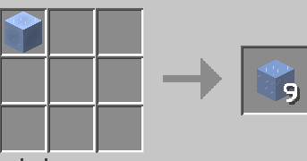      | :x:                 | :no_entry_sign:|
| packed_ice_from_blue_ice | 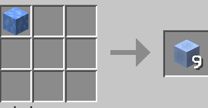 | :x:                 | :no_entry_sign:|
| **- Smooth blocks** |
| smooth_quartz        | 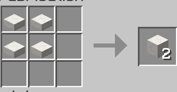        | :heavy_check_mark:  | :no_entry_sign:|
| smooth_red_sandstone | 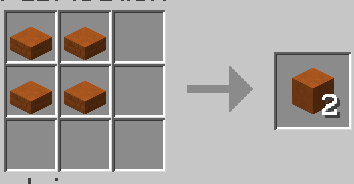 | :heavy_check_mark:  | :no_entry_sign:|
| smooth_sandstone     | 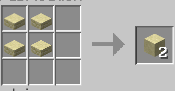     | :heavy_check_mark:  | :no_entry_sign:|
| smooth_stone         | 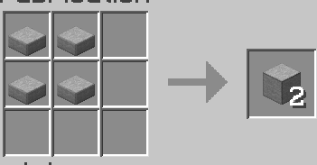         | :heavy_check_mark:  | :no_entry_sign:|
| **- Coral** |
| coral_fan/*                | 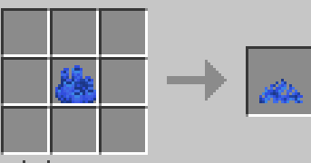               | :x:                 | All coral / dead coral |
| coral_plants/from_fan/*    | 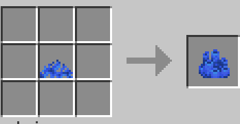    | :x:                 | All coral / dead coral |
| coral_plants/from_blocks/* | 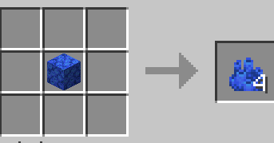 | :x:                 | All coral / dead coral |
| coral_blocks/*             | 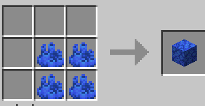            | :heavy_check_mark:  | All coral / dead coral |


###### Items

| Name             | Craft                                    | Respect the paterne | other |
|:----------------:|:----------------------------------------:|:-------------------:|:--|
| cobweb_to_string | 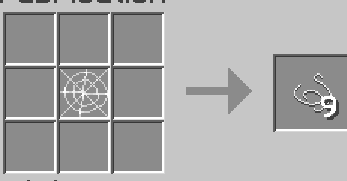 | :x:                 | :no_entry_sign:|
| string_to_cobweb | 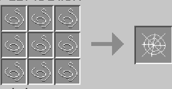 | :heavy_check_mark:  | :no_entry_sign:|
| wool_to_string   | 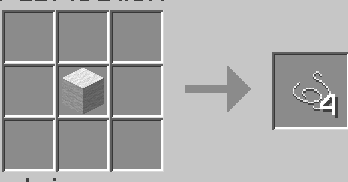   | :x:                 | All colors|


##### Smelting
[:open_file_folder:folder => data/phoenix/recipes/smelting](data/phoenix/recipes/smelting)

| Name  | Smelting                            |
|:-----:|:-----------------------------------:|
| magma | 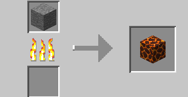 |
